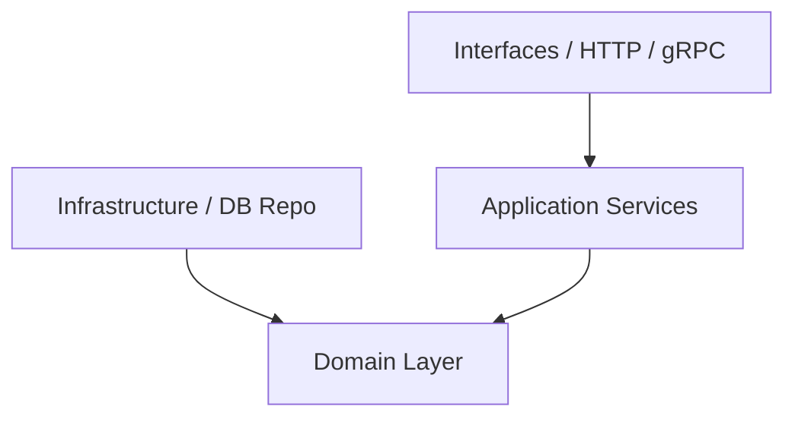

# HRIS Backend - Domain-Driven Design (DDD) & Coding Guidelines

Dokumen ini berisi arsitektur, aturan dependency, struktur folder, dan standar penulisan kode Go untuk project HRIS Backend. Semua agent dan developer harus mematuhi aturan di bawah ini secara ketat.

---

## 1. Struktur Folder (DDD)

Project ini menggunakan arsitektur Domain-Driven Design (DDD) yang memisahkan tanggung jawab kode ke dalam layer-layer berikut:

```text
hris-backend/
├── cmd/                          # Entry point aplikasi
│   └── api/
│       └── main.go               # Inisialisasi app, dependency injection, & start server
├── internal/                     # Semua Core Logic dibungkus dalam folder internal
│   ├── domain/                   # Core Business Logic (Terpusat)
│   │   ├── employee/             # Domain Employee (Contoh Bounded Context)
│   │   │   ├── entity.go         # Struct Entity & Value Objects
│   │   │   ├── repository.go     # Interface Repository (Abstraksi data store)
│   │   │   └── service.go        # Domain Service (jika memerlukan koordinasi antar Entity)
│   │   └── attendance/           # Domain Attendance
│   │       └── ...
│   ├── application/              # Use Cases / Application Services
│   │   ├── employee/
│   │   │   └── service.go        # Application service (koordinasi transaksi, mapping DTO, read/write logic)
│   │   └── DTOs / Request-Response structs
│   ├── infrastructure/           # Implementasi detail teknis & library pihak ketiga
│   │   ├── database/             # Postgres, GORM setup
│   │   ├── repository/           # Realisasi interface repo domain (e.g., Postgres implementation)
│   │   │   └── employee_postgres.go
│   │   ├── messaging/            # PubSub, Kafka, RabbitMQ
│   │   └── config/               # Konfigurasi aplikasi (Viper)
│   └── interfaces/               # Interface luar / Presentation Layer
│       ├── http/                 # HTTP Handlers (Fiber v3)
│       │   ├── employee/         # Foldering by Domain
│       │   │   ├── handler.go      # Endpoint handler
│       │   │   └── request.go      # Request DTO / binding (opsional)
│       │   └── middleware/
│       └── grpc/                 # gRPC Handlers (jika ada)
```

---

## 2. Aturan Dependency (Dependency Rules)

Mengikuti prinsip **Clean Architecture**:
* **Domain Layer** adalah pusat aplikasi dan **TIDAK BOLEH** mengimport package dari layer lain (`application`, `infrastructure`, atau `interfaces` di bawah `internal`). Domain hanya berisi pure Go standard library dan struct bisnis.
* **Application Layer** mengkoordinasikan bisnis flow. Layer ini mengimport `domain`, tetapi **TIDAK BOLEH** mengimport detail dari `infrastructure` secara langsung (harus melalui interface/abstraksi repo di domain).
* **Infrastructure Layer** mengimplementasikan detail teknis (database, API client). Layer ini mengimport `domain` (untuk mengimplementasikan interface repo).
* **Interfaces/Presentation Layer** menerima request dari luar (HTTP/gRPC/CLI), memanggil `application service`, dan mengembalikan response.



---

## 3. Aturan Coding per Layer

### A. Domain Layer
* **Entities**: Buat struct yang merepresentasikan identitas unik (misal `Employee` dengan `ID`). Gunakan constructor function (e.g., `NewEmployee(...)`) untuk memastikan entity selalu dalam state yang valid saat di-instantiate.
* **Value Objects**: Struct tanpa identitas unik yang mendeskripsikan karakteristik (misal `Address`, `Money`). Bersifat *immutable*.
* **Validation**: Lakukan validasi rule bisnis di dalam domain entity, bukan di HTTP handler.
* **Pure Domain**: Domain entities **TIDAK BOLEH** memiliki GORM tags (e.g., `gorm:"primaryKey"`). Jika representasi database berbeda, definisikan struct Model terpisah di layer `infrastructure` dan lakukan mapping ke/dari Domain Entity.
* **Repository Interfaces**: Definisikan interface repo di sini.
  ```go
  // domain/employee/repository.go
  type Repository interface {
      Save(ctx context.Context, employee *Employee) error
      FindByID(ctx context.Context, id string) (*Employee, error)
  }
  ```

### B. Application Layer
* Bertanggung jawab untuk transaksi database (`Transaction Management`).
* Menerima DTO (Data Transfer Object) dari interface layer, lalu mengubahnya menjadi domain entities.
* Memanggil repository untuk mengambil/menyimpan entity, dan menjalankan logic aplikasi.
* *Jangan* meletakkan query SQL atau JSON tags di layer ini.

### C. Infrastructure Layer
* Mengimplementasikan interface repository yang didefinisikan di domain.
* Tempat di mana SQL query, ORM (Gorm/SQLX), database driver, dan library external berada.
* **Model Database**: Jika ada pemetaan database GORM yang rumit, letakkan struct model database di sini (e.g., `infrastructure/repository/models/employee_model.go`) lengkap dengan tag `gorm` dan helper mapper untuk konversi ke Entity Domain.
* **Database Migrations**: Semua modifikasi skema database wajib menggunakan SQL migrasi yang dibuat via `make migrate-create` dan diletakkan di folder `./migrations`. Dilarang keras menggunakan GORM `AutoMigrate` pada environment production.
* Contoh penamaan file repository: `employee_postgres.go`.

### D. Interfaces/HTTP Layer
* Parsing request (JSON/Form binding, URL query parameter).
* **Validasi input**: WAJIB menggunakan `go-playground/validator/v10` melalui package wrapper `pkg/validator`. Jika validasi gagal, kembalikan HTTP `422 Unprocessable Entity` dengan format dictionary array (seperti standar Laravel).
* Panggil Application Service.
* Mengembalikan response HTTP menggunakan package `pkg/response` (`response.Success` atau `response.Error`) untuk menjamin standardisasi JSON (berisi `code`, `status`, `message`, `data`/`errors`). Pastikan field `data` mengembalikan `[]` jika array kosong (hindari `null` slice).

---

## 4. Konvensi Kode Go

1. **Gunakan Context**: Selalu sertakan `context.Context` sebagai argumen pertama pada fungsi-fungsi di layer application, domain repository, dan infrastructure (misal `FindByID(ctx context.Context, id string)`).
2. **Error Handling**: 
   - Tangani error sedini mungkin.
   - Jangan abaikan error (`_ = someFunc()`).
   - Gunakan custom domain error (misal `ErrEmployeeNotFound = errors.New("employee not found")`) di layer domain agar interface layer bisa memetakan status HTTP dengan tepat (misal 404 Not Found).
3. **Dependency Injection (Google Wire)**: Proyek ini wajib menggunakan `google/wire` untuk injeksi dependensi secara compile-time. Semua dependensi (Repository, Service, Handler) di-registrasikan ke dalam `wire.ProviderSet` di dalam file `internal/di/wire.go`. File `cmd/api/server.go` akan bersih karena cukup memanggil `di.InitializeAPI(s.db, tokenGenerator)`.
4. **Cross-Domain Communication (Bounded Contexts)**: Untuk saat ini, komunikasi antar modul/domain dilakukan secara langsung (Synchronous) melalui injeksi *Application Service* modul lain menggunakan `google/wire` (bukan menggunakan Message Broker/Event Bus). Hindari injeksi *Repository* modul lain secara langsung ke dalam *Service*; selalu gunakan *Application Service* modul tersebut sebagai jembatan/API internal.
5. **Configuration**: Load konfigurasi dari environment variables atau config file sekali saja di `cmd/api/main.go` menggunakan library seperti `viper` atau `envconfig`, lalu teruskan struct config ke service yang membutuhkan.
6. **Acronym Naming Consistency**: Ikuti standar Go untuk akronim (misal ID, HTTP, URL, API). Jika menggunakan *CamelCase* untuk akronim lokal seperti KTP atau PTKP, pastikan konsisten secara presisi (termasuk huruf besar-kecil) antara *Domain Entity*, *GORM Model*, dan *DTO*. Contoh: gunakan `PtkpStatus` di semua layer, jangan dicampur dengan `PTKPStatus`.
7. **Mandatory Build Check**: AI WAJIB menjalankan perintah `go build ./...` di terminal setiap kali selesai men-generate atau memodifikasi kumpulan file `.go`. Tujuannya untuk menangkap *syntax error*, salah *type*, atau *import* yang hilang sebelum melaporkan pekerjaan selesai kepada user.

---

## 5. Dokumentasi API (Swagger & Bruno)

Setiap endpoint API yang dibuat harus didokumentasikan di dua tempat dengan aturan "Split by Domain" (per file untuk setiap domain, bukan monolithic):

**ATURAN WAJIB (STRICT RULES):**
- **Anti-Duplikasi:** AI WAJIB mengecek eksistensi rute/file yang sudah ada (menggunakan fitur *search* atau `ls`) sebelum meng-generate endpoint baru untuk menghindari duplikasi.
- **Konsistensi Variabel URL:** Parameter di URL harus konsisten. Pada dokumentasi Swagger gunakan `{id}`, pada Bruno gunakan `:id`. Jangan gunakan penamaan *custom* yang bisa membingungkan FE (seperti `:employee_id` atau `{{employee_id}}`).
- **Exhaustive Error Responses:** Dokumentasi *Response* tidak boleh asal-asalan. AI WAJIB membaca file `handler.go` untuk mendaftar SEMUA HTTP Error Code yang mungkin terjadi (`200`, `201`, `400`, `404`, `409`, `422`, `500`). Khusus untuk `422 Unprocessable Entity`, wajib menyertakan contoh array error dari validator.
- **API Contract Versioning:** Setiap kali terjadi perubahan, perbaikan, atau penambahan endpoint baru pada API contract, AI **WAJIB** menaikkan versi API contract menggunakan format **Semantic Versioning (SemVer, e.g., MAJOR.MINOR.PATCH)** pada field `info.version` di spesifikasi Swagger YAML serta memperbarui info versi di koleksi Bruno jika dibutuhkan.

1. **Swagger OpenAPI (YAML)** di `docs/api/swagger/<domain>.yaml`. Wajib mendeskripsikan `requestBody`, `responses` super komplit, `required` fields, dan `example`. Pastikan untuk menghapus rute *dummy/monolith* jika sistem sudah menerapkan pola modular/Progressive Save. AI **WAJIB** mendaftarkan berkas YAML baru ke dalam environment `URLS` pada [docker-compose.yaml](file:///Users/dystopia/go/hris-backend/docs/api/swagger/docker-compose.yaml) agar langsung tampil di Swagger UI lokal.
2. **Bruno Collection** di `docs/api/bruno/<Domain>/<EndpointName>.bru`. Wajib menyertakan blok `docs { ... }` (menggunakan format Markdown) yang menjelaskan endpoint, `required` properties, dan seluruh variasi *Expected Responses* persis seperti yang tercatat di Swagger.

---

## 8. Git Commit & Versioning (Conventional Commits)
Semua commit harus menggunakan format **Conventional Commits**:
- `feat:` (fitur baru)
- `fix:` (perbaikan bug)
- `docs:` (dokumentasi, termasuk PRD/RFC)
- `refactor:` (restrukturisasi kode)
- `chore:` (maintenance, update dependensi, generate wire)

**Aturan Penting:**
1. **Atomik:** Dilarang menggabung perubahan fitur A dengan bugfix B dalam satu commit. Pecah menjadi beberapa commit jika perlu.
2. **Workflow:** Gunakan *slash command* `/git-commit` agar AI mengelompokkan file dan menulis pesan commit secara otomatis.
3. **Changelog:** Jika ada perubahan besar, AI akan memperbarui file `CHANGELOG.md`.

---

## 6. Dokumen Proyek (Requirements & Technical)

Ada dua jenis dokumen yang wajib disimpan ke dalam repositori secara permanen:
1. **Product Requirements Document (PRD):** 
   - Jika user meminta rancangan fitur, requirement, atau skema bisnis (bukan teknis database murni), gunakan format PRD.
   - **WAJIB** disimpan di folder `docs/requirement/` (contoh: `docs/requirement/employee.md`).
   - Format penulisan wajib mematuhi panduan dari skill `scaffold-prd`.
2. **Dokumen Teknis & Arsitektur (Enterprise Tech Specs):**
   - Setiap rancangan arsitektur sistem, struktur database, atau *implementation plan* murni teknis, **WAJIB** disimpan di dalam sub-folder per domain di `docs/technical/<domain_name>/`.
   - Dokumentasi di dalam folder tersebut **harus dipecah** menjadi beberapa file spesifik:
     - `tech-spec.md` (Arsitektur inti, API, dan skema DB).
     - `user-stories.md` (Alur logika dan diagram *sequence*).
     - `decision-log.md` (ADR - Mencatat *kenapa* keputusan teknis tertentu diambil).
     - Serta dokumen pendukung opsional seperti `data-dictionary.md`, `infrastructure.md`, dan `test-plan.md`.
3. **Database Markup (DBML):**
   - Skema database relasional **WAJIB** ditulis dalam format DBML (`.dbml`) dan disimpan di folder `docs/databases/` (contoh: `docs/databases/employee.dbml`).
   - Tujuannya agar arsitektur ERD bisa divisualisasikan dengan mudah via dbdiagram.io.

---

## 7. UUID Generation (Primary Key)

Semua entitas yang menggunakan UUID sebagai Primary Key wajib mengimplementasikan pola *auto-generate* UUID pada dua *layer* berikut:
1. **Domain Layer (`entity.go`)**: Di dalam *constructor function* (`NewEntityName(...)`), pastikan ada pengecekan jika ID kosong, maka diisi dengan UUID baru (`if id == "" { id = uuid.New().String() }`).
2. **Infrastructure Layer (`models.go`)**: Tambahkan *hook* GORM `BeforeCreate` pada model yang bersangkutan untuk mengisi `m.ID` dengan UUID baru jika masih kosong.
