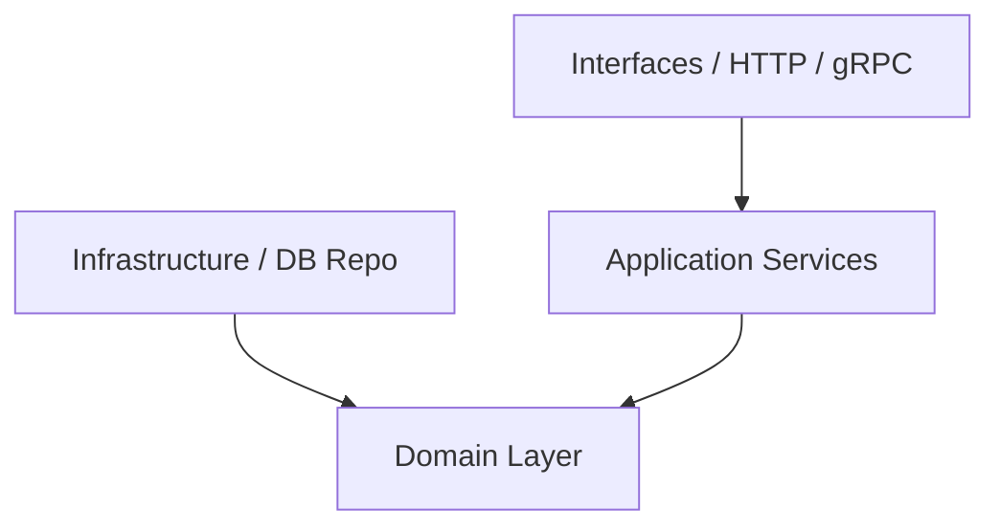

# Architecture & Struktur Folder (DDD)

Project ini menggunakan arsitektur Domain-Driven Design (DDD) yang memisahkan tanggung jawab kode ke dalam layer-layer berikut.

## Struktur Folder (Domain-First / Package-by-Bounded-Context)

Project ini memakai pola **domain-first**: tiap bounded context adalah **satu folder utuh** di bawah `internal/`, berisi keempat layer Clean Architecture di dalamnya. Tujuannya agar tiap context berdiri mandiri dan siap diekstrak menjadi service terpisah tanpa memungut file dari banyak tempat.

```text
hris-backend/
├── cmd/                          # Entry point aplikasi
│   ├── api/                      # HTTP server (main.go, server.go)
│   └── seed/                     # Seeder
├── internal/                     # Semua Core Logic dibungkus dalam folder internal
│   ├── employee/                 # Bounded Context Employee (contoh; 1 folder = 1 context utuh)
│   │   ├── domain/               # Core Business Logic — package `domain`
│   │   │   ├── entity.go         # Struct Entity & Value Objects (pure Go, TANPA GORM tag)
│   │   │   ├── repository.go     # Interface Repository (abstraksi data store)
│   │   │   └── service.go        # Domain Service (opsional, koordinasi antar Entity)
│   │   ├── application/          # Use Cases / Application Services — package `application`
│   │   │   ├── service.go        # Koordinasi transaksi, mapping DTO, read/write logic
│   │   │   └── dto.go            # Request/Response DTO structs
│   │   ├── infrastructure/       # Detail teknis milik context ini — package `infrastructure`
│   │   │   ├── postgres.go       # Implementasi interface repo domain (GORM/Postgres)
│   │   │   └── models/           # GORM model + mapper ToDomain()/FromDomain() — package `models`
│   │   │       └── employee_model.go
│   │   └── transport/            # Presentation Layer — package per protokol
│   │       └── http/             # HTTP Handlers (Fiber v3) — package `http`
│   │           ├── handler.go    # Endpoint handler
│   │           └── router.go     # Register routes
│   ├── organization/             # Bounded Context lain (struktur sama)
│   ├── auth/                     # Context auth (jwt impl ada di auth/infrastructure/)
│   ├── user/                     # Context internal (hanya domain + infrastructure)
│   ├── shared/                   # Cross-cutting, BUKAN milik satu context
│   │   ├── config/               # Konfigurasi aplikasi (Viper)
│   │   ├── database/             # Postgres / GORM setup
│   │   └── middleware/           # HTTP middleware lintas domain (auth, dll.)
│   └── di/                       # Dependency Injection (google/wire) — tahu semua context
│       ├── wire.go               # ProviderSet
│       ├── wire_gen.go           # Generated
│       └── api.go                # APIHandlers + RegisterRoutes
└── pkg/                          # Util reusable lintas project (BUKAN di-shared)
    ├── response/                 # Envelope response standar
    └── validator/                # Wrapper go-playground/validator
```

> **Nama package = nama layer** (`domain`, `application`, `infrastructure`, `models`, `http`). Karena banyak context berbagi nama package sama, layer `di/` dan `cmd/` **WAJIB** memakai import alias deskriptif (mis. `empDomain`, `orgApp`, `empHTTP`). Di dalam satu context, referensi antar-layer cukup singkat (`application.Service`, `domain.Employee`) tanpa alias.

---

## Aturan Dependency (Dependency Rules)

Mengikuti prinsip **Clean Architecture**:
* **Domain Layer** adalah pusat aplikasi dan **TIDAK BOLEH** mengimport package dari layer lain (`application`, `infrastructure`, atau `interfaces` di bawah `internal`). Domain hanya berisi pure Go standard library dan struct bisnis.
* **Application Layer** mengkoordinasikan bisnis flow. Layer ini mengimport `domain`, tetapi **TIDAK BOLEH** mengimport detail dari `infrastructure` secara langsung (harus melalui interface/abstraksi repo di domain).
* **Infrastructure Layer** mengimplementasikan detail teknis (database, API client). Layer ini mengimport `domain` (untuk mengimplementasikan interface repo).
* **Transport/Presentation Layer** (folder `transport/`, dulu `interfaces/`) menerima request dari luar (HTTP/gRPC/CLI), memanggil `application service`, dan mengembalikan response.



---

## Aturan Coding per Layer

### A. Domain Layer
* **Entities**: Buat struct yang merepresentasikan identitas unik (misal `Employee` dengan `ID`). Gunakan constructor function (e.g., `NewEmployee(...)`) untuk memastikan entity selalu dalam state yang valid saat di-instantiate.
* **Value Objects**: Struct tanpa identitas unik yang mendeskripsikan karakteristik (misal `Address`, `Money`). Bersifat *immutable*.
* **Validation**: Lakukan validasi rule bisnis di dalam domain entity, bukan di HTTP handler.
* **Pure Domain**: Domain entities **TIDAK BOLEH** memiliki GORM tags (e.g., `gorm:"primaryKey"`). Jika representasi database berbeda, definisikan struct Model terpisah di layer `infrastructure` dan lakukan mapping ke/dari Domain Entity.
* **Repository Interfaces**: Definisikan interface repo di sini.
  ```go
  // internal/employee/domain/repository.go
  type Repository interface {
      Save(ctx context.Context, employee *Employee) error
      FindByID(ctx context.Context, id string) (*Employee, error)
  }
  ```

### B. Application Layer
* Bertanggung jawab untuk transaksi database (`Transaction Management`).
* Menerima DTO (Data Transfer Object) dari interface layer, lalu mengubahnya menjadi domain entities.
* Memanggil repository untuk mengambil/menyimpan entity, dan menjalankan logic aplikasi.
* *Jangan* meletakkan query SQL atau JSON tags di layer ini.

### C. Infrastructure Layer
* Mengimplementasikan interface repository yang didefinisikan di domain.
* Tempat di mana SQL query, ORM (Gorm/SQLX), database driver, dan library external berada.
* **Model Database**: Jika ada pemetaan database GORM yang rumit, letakkan struct model database di sini (e.g., `internal/employee/infrastructure/models/employee_model.go`) lengkap dengan tag `gorm` dan helper mapper untuk konversi ke Entity Domain.
* **Database Migrations**: Semua modifikasi skema database wajib menggunakan SQL migrasi yang dibuat via `make migrate-create` dan diletakkan di folder `./migrations`. Dilarang keras menggunakan GORM `AutoMigrate` pada environment production.
* Contoh penamaan file repository: `internal/employee/infrastructure/postgres.go` (impl) — bukan lagi `infrastructure/repository/employee_postgres.go`.
* **Persistensi**: patuhi [persistence-convention.md](persistence-convention.md) — dilarang `db.Save()` untuk upsert by non-PK key, transaksi dimiliki application layer, dan `FindXxx` not-found wajib sentinel error.

### D. Transport/HTTP Layer (`internal/<context>/transport/http/`)
* Parsing request (JSON/Form binding, URL query parameter).
* **Validasi input**: WAJIB menggunakan `go-playground/validator/v10` melalui package wrapper `pkg/validator`. Jika validasi gagal, kembalikan HTTP `422 Unprocessable Entity` dengan format dictionary array (seperti standar Laravel).
* Panggil Application Service.
* Mengembalikan response HTTP menggunakan package `pkg/response` (`response.Success` atau `response.Error`) untuk menjamin standardisasi JSON (berisi `code`, `status`, `message`, `data`/`errors`). Pastikan field `data` mengembalikan `[]` jika array kosong (hindari `null` slice).
