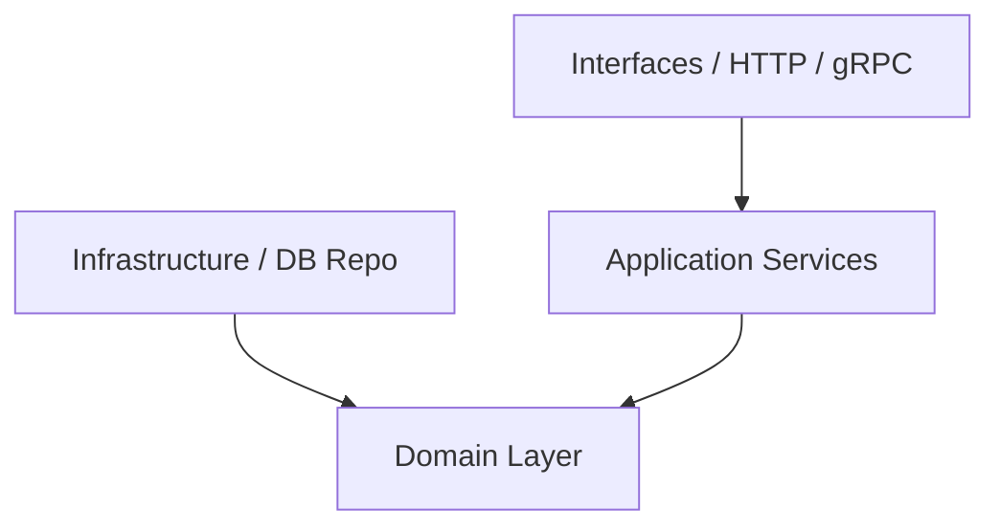

# HRIS Backend - Domain-Driven Design (DDD) & Coding Guidelines

Dokumen ini berisi arsitektur, aturan dependency, struktur folder, dan standar penulisan kode Go untuk project HRIS Backend. Semua agent dan developer harus mematuhi aturan di bawah ini secara ketat.

---

## 1. Struktur Folder (DDD)

Project ini menggunakan arsitektur Domain-Driven Design (DDD) yang memisahkan tanggung jawab kode ke dalam layer-layer berikut:

```text
hris-backend/
├── cmd/                          # Entry point aplikasi
│   └── api/
│       └── main.go               # Inisialisasi app, dependency injection, & start server
├── domain/                       # Core Business Logic (Layer Terluar secara Logika/Terpusat)
│   ├── employee/                 # Domain Employee (Contoh Bounded Context)
│   │   ├── entity.go             # Struct Entity & Value Objects
│   │   ├── repository.go         # Interface Repository (Abstraksi data store)
│   │   └── service.go            # Domain Service (jika memerlukan koordinasi antar Entity)
│   └── attendance/               # Domain Attendance
│       └── ...
├── application/                  # Use Cases / Application Services
│   ├── employee/
│   │   └── service.go            # Application service (koordinasi transaksi, mapping DTO, read/write logic)
│   └── DTOs / Request-Response structs
├── infrastructure/               # Implementasi detail teknis & library pihak ketiga
│   ├── database/                 # Postgres, MySQL, MongoDB setup
│   ├── repository/               # Realisasi interface repo domain (e.g., Postgres implementation)
│   │   └── employee_postgres.go
│   ├── messaging/                # PubSub, Kafka, RabbitMQ
│   └── config/                   # Konfigurasi aplikasi
└── interfaces/                   # Interface luar / Presentation Layer
    ├── http/                     # HTTP Handlers (Fiber v3)
    │   ├── router.go
    │   └── employee_handler.go
    └── grpc/                     # gRPC Handlers (jika ada)
```

---

## 2. Aturan Dependency (Dependency Rules)

Mengikuti prinsip **Clean Architecture**:
* **Domain Layer** adalah pusat aplikasi dan **TIDAK BOLEH** mengimport package dari layer lain (`application`, `infrastructure`, atau `interfaces`). Domain hanya berisi pure Go standard library dan struct bisnis.
* **Application Layer** mengkoordinasikan bisnis flow. Layer ini mengimport `domain`, tetapi **TIDAK BOLEH** mengimport detail dari `infrastructure` secara langsung (harus melalui interface/abstraksi repo di domain).
* **Infrastructure Layer** mengimplementasikan detail teknis (database, API client). Layer ini mengimport `domain` (untuk mengimplementasikan interface repo).
* **Interfaces/Presentation Layer** menerima request dari luar (HTTP/gRPC/CLI), memanggil `application service`, dan mengembalikan response.



---

## 3. Aturan Coding per Layer

### A. Domain Layer
* **Entities**: Buat struct yang merepresentasikan identitas unik (misal `Employee` dengan `ID`). Gunakan constructor function (e.g., `NewEmployee(...)`) untuk memastikan entity selalu dalam state yang valid saat di-instantiate.
* **Value Objects**: Struct tanpa identitas unik yang mendeskripsikan karakteristik (misal `Address`, `Money`). Bersifat *immutable*.
* **Validation**: Lakukan validasi rule bisnis di dalam domain entity, bukan di HTTP handler.
* **Pure Domain**: Domain entities **TIDAK BOLEH** memiliki GORM tags (e.g., `gorm:"primaryKey"`). Jika representasi database berbeda, definisikan struct Model terpisah di layer `infrastructure` dan lakukan mapping ke/dari Domain Entity.
* **Repository Interfaces**: Definisikan interface repo di sini.
  ```go
  // domain/employee/repository.go
  type Repository interface {
      Save(ctx context.Context, employee *Employee) error
      FindByID(ctx context.Context, id string) (*Employee, error)
  }
  ```

### B. Application Layer
* Bertanggung jawab untuk transaksi database (`Transaction Management`).
* Menerima DTO (Data Transfer Object) dari interface layer, lalu mengubahnya menjadi domain entities.
* Memanggil repository untuk mengambil/menyimpan entity, dan menjalankan logic aplikasi.
* *Jangan* meletakkan query SQL atau JSON tags di layer ini.

### C. Infrastructure Layer
* Mengimplementasikan interface repository yang didefinisikan di domain.
* Tempat di mana SQL query, ORM (Gorm/SQLX), database driver, dan library external berada.
* **Model Database**: Jika ada pemetaan database GORM yang rumit, letakkan struct model database di sini (e.g., `infrastructure/repository/models/employee_model.go`) lengkap dengan tag `gorm` dan helper mapper untuk konversi ke Entity Domain.
* **Database Migrations**: Semua modifikasi skema database wajib menggunakan SQL migrasi yang dibuat via `make migrate-create` dan diletakkan di folder `./migrations`. Dilarang keras menggunakan GORM `AutoMigrate` pada environment production.
* Contoh penamaan file repository: `employee_postgres.go`.

### D. Interfaces/HTTP Layer
* Parsing request (JSON/Form binding, URL query parameter).
* Validasi format input dasar (misal format email valid secara sintaksis, field mandatory terisi).
* Panggil Application Service.
* Mengembalikan response HTTP (Status Code, JSON payload).

---

## 4. Konvensi Kode Go

1. **Gunakan Context**: Selalu sertakan `context.Context` sebagai argumen pertama pada fungsi-fungsi di layer application, domain repository, dan infrastructure (misal `FindByID(ctx context.Context, id string)`).
2. **Error Handling**: 
   - Tangani error sedini mungkin.
   - Jangan abaikan error (`_ = someFunc()`).
   - Gunakan custom domain error (misal `ErrEmployeeNotFound = errors.New("employee not found")`) di layer domain agar interface layer bisa memetakan status HTTP dengan tepat (misal 404 Not Found).
3. **Dependency Injection**: Gunakan konstruktor (e.g., `NewService(repo domain.Repository)`) untuk passing dependencies. Gunakan library Dependency Injection (seperti `google/wire`) jika project sudah semakin besar.
4. **Configuration**: Load konfigurasi dari environment variables atau config file sekali saja di `cmd/api/main.go` menggunakan library seperti `viper` atau `envconfig`, lalu teruskan struct config ke service yang membutuhkan.
