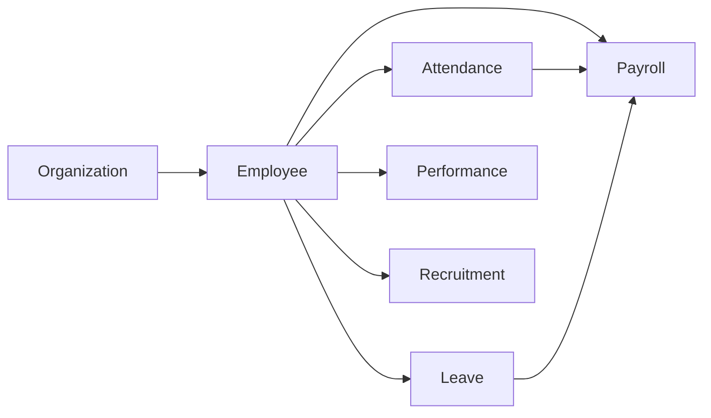

# PRD Index — HRIS Backend

Pusat semua **Product Requirements Document (PRD)** HRIS. Satu file per modul (bounded context), selaras dengan arsitektur domain-first di `internal/`.

> Aturan penulisan PRD: lihat skill `scaffold-prd` dan [rules/project-docs.md](../../.agents/rules/project-docs.md).
> **Wajib:** setiap PRD baru / perubahan status / bump versi → perbarui tabel & graph di file ini.

---

## 📋 Module Registry

| Modul | File | Versi | Status | Owner | Updated |
|---|---|---|---|---|---|
| Organization | [organization.md](organization.md) | — | — | — | — |
| Employee | [employee.md](employee.md) | — | — | — | — |
| Attendance & Time Tracking | _belum ada_ | — | Planned | — | — |
| Leave / Time-off | _belum ada_ | — | Planned | — | — |
| Payroll & Compensation | _belum ada_ | — | Planned | — | — |
| Performance Management | _belum ada_ | — | Planned | — | — |
| Recruitment & Onboarding | _belum ada_ | — | Planned | — | — |

> Kolom Versi/Status/Owner/Updated diambil dari frontmatter tiap PRD. Isi saat PRD dibuat.
> Status: `Draft` | `In Review` | `Approved` | `Deprecated` | `Planned` (belum ada file).

---

## 🔗 Module Dependency Graph

Peta ketergantungan antar modul. Update tiap ada edge `depends_on` baru.



> Baca arah panah sebagai "dibutuhkan oleh". Contoh: `Attendance --> Payroll` = Payroll butuh Attendance.
> Graph di atas perkiraan awal; sesuaikan dengan `depends_on` nyata tiap PRD begitu ditulis.

---

## 📁 Konvensi Folder

```text
docs/PRD/
├── README.md            # index ini
├── _shared/
│   └── glossary.md      # istilah & konsep lintas modul (single source)
├── organization.md
├── employee.md
└── <modul>.md
```

**Aturan coupling:** loose coupling di dokumen, sama seperti di kode. Modul dependent **merujuk** field/section modul induk (+ versi), bukan copy-paste aturan bisnisnya. Konsep yang dipakai banyak modul naik ke [`_shared/glossary.md`](_shared/glossary.md).
