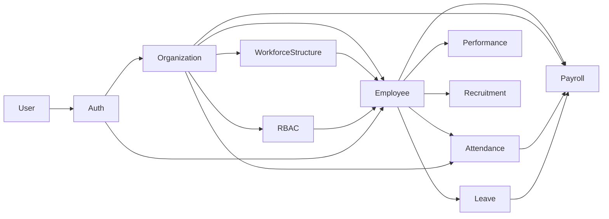

# PRD Index — HRIS Backend

Pusat semua **Product Requirements Document (PRD)** HRIS. Satu file per modul (bounded context), selaras dengan arsitektur domain-first di `internal/`.

> 🧭 **Baca dulu:** [product-vision.md](product-vision.md) — Global PRD / North Star. Menetapkan arah produk & aksioma (single-owner group/holding, **bukan SaaS**) yang mengunci semua PRD modul.

> Aturan penulisan PRD: lihat skill `scaffold-prd` dan [rules/project-docs.md](../../.agents/rules/project-docs.md).
> **Wajib:** setiap PRD baru / perubahan status / bump versi → perbarui tabel & graph di file ini.

---

## 🆕 Cara Membuat PRD Baru (dari Nol)

1. **Tentukan modul (bounded context).** Satu file = satu modul, nama file samain sama nama folder domain di `internal/` kalau kodenya udah ada (mis. `internal/auth/` → `docs/PRD/auth.md`).
2. **Panggil skill `scaffold-prd`** (atau ikuti manual format-nya) untuk isi frontmatter wajib:
   ```yaml
   ---
   module: Auth
   version: 1.0.0
   status: Draft
   owner: <nama>
   updated: yyyy-MM-dd HH:mm:ss   # waktu Asia/Jakarta, sampai detik — bukan tanggal doang
   depends_on: [user@1.0.0]        # [] kalau gak depend modul lain
   ---
   ```
3. **Kalau modul udah ada kodenya** (bukan modul baru murni) — **WAJIB baca kode nyata dulu** (domain/application/infrastructure/transport) sebelum nulis satu baris pun PRD. Jangan asumsi dari nama fungsi/file doang. Ini penting biar Acceptance Criteria & Constraints refleksikan kondisi sebenarnya, bukan wishful thinking.
4. **Isi 6 Pillar wajib** (lihat skill `scaffold-prd` untuk detail tiap section):
   1. Tujuan & Dampak (Why)
   2. Scope & Out-of-Scope
   3. User Roles & Permissions
   4. Kriteria Penerimaan (Given-When-Then)
   5. Technical & Architectural Constraints
   6. Dependencies (Depends on / Consumed by / External integrations)
5. **Tambah Section 7 — Data Schema & Business Rules**: breakdown entity + tabel sample data (bukan pengganti DBML, cuma ilustrasi buat FE).
6. **Kalau ketemu gap antara kode nyata vs kontrak yang dijanjikan modul lain** (mis. Modul A janji "modul B bakal blokir X", tapi kode B belum ngelakuin itu) — catat eksplisit sebagai *"Catatan implementasi"* di Acceptance Criteria terkait. Jangan didiemin atau disamarkan seolah udah beres.
7. **Kalau modul ini depend ke modul yang belum punya PRD sendiri** — jangan taro rujukan vague ("lihat modul X" tanpa versi). Tandain sebagai gap, dan pertimbangkan bikin PRD modul itu duluan/menyusul.
8. **Update index ini** (`README.md`) — tambah baris di Module Registry + edge baru di Dependency Graph kalau ada relasi `depends_on`.
9. Kalau modul di atas tier **Simpel** (ada relasi antar-entity/state flow/depend modul lain), lanjut ke `tech-spec.md` (dan `decision-log.md`/`user-stories.md` kalau Kompleks) — lihat [project-docs.md](../../.agents/rules/project-docs.md) tabel tier. Dan buat skema database via skill `scaffold-dbml` (`docs/databases/<modul>.dbml`, wajib semua tier).

## 🔄 Cara Update PRD Existing

1. **Mention file PRD lama** sebagai rujukan, jelasin perubahan/fitur yang mau ditambah.
2. **Brainstorm dulu** sebelum eksekusi — align dulu scope perubahan, jangan langsung tulis ulang.
3. **Edit konten** section yang relevan. Histori lama yang masih valid jangan dihapus asal-asalan, kecuali emang deprecated.
4. **Bump `version`** (SemVer), sesuai dampak perubahan:
   - **PATCH** (1.0.0→1.0.1): typo, klarifikasi kalimat — gak ubah makna kontrak.
   - **MINOR** (1.0.0→1.1.0): nambah scope/fitur baru yang backward-compatible.
   - **MAJOR** (1.0.0→2.0.0): breaking change ke kontrak yang direferensi modul lain lewat `depends_on`.
5. **Update frontmatter**: `updated` (timestamp Asia/Jakarta terbaru, `yyyy-MM-dd HH:mm:ss`), `status` kalau siklusnya berubah (`Draft` → `In Review` → `Approved` → `Deprecated`).
6. **WAJIB sync index ini** — Module Registry (versi/status/updated) + Dependency Graph kalau ada edge berubah/baru.
7. **Cek ripple ke PRD dependent** — kalau ada modul lain yang `depends_on` versi modul ini, dan perubahannya breaking (MAJOR), update pointer versi + validasi ulang section yang mereka rujuk masih akurat.
8. **Kalau modul punya `tech-spec.md`/`decision-log.md`** (tier Sedang/Kompleks) — perubahan teknis non-trivial disinkronkan di sana juga. Prinsip tetap: PRD = WHAT/WHY, tech-spec = HOW. Jangan campur.
9. **Commit atomik** `docs:` — jangan digabung sama commit `feat:`/`fix:` kode di commit yang sama ([commit-convention.md](../../.agents/rules/commit-convention.md)).

---

## 📋 Module Registry

| Modul | File | Versi | Status | Owner | Updated |
|---|---|---|---|---|---|
| Organization (Company & Branch) | [organization.md](organization.md) | 2.0.0 | Draft | bagusyanuar | 2026-07-23 13:46:17 |
| Workforce Structure (Dept/Title/Position) | [workforce-structure.md](workforce-structure.md) | 1.0.0 | Draft | bagusyanuar | 2026-07-23 13:46:17 |
| Employee | [employee.md](employee.md) | — | — | — | — |
| RBAC (company/branch scoping) | _belum ada_ | — | Planned | — | — |
| Auth | [auth.md](auth.md) | 1.0.0 | Draft | bagusyanuar | 2026-07-22 22:48:47 |
| User | [user.md](user.md) | 1.0.0 | Draft | bagusyanuar | 2026-07-22 22:48:47 |
| Attendance & Time Tracking | _belum ada_ | — | Planned | — | — |
| Leave / Time-off | _belum ada_ | — | Planned | — | — |
| Payroll & Compensation | _belum ada_ | — | Planned | — | — |
| Performance Management | _belum ada_ | — | Planned | — | — |
| Recruitment & Onboarding | _belum ada_ | — | Planned | — | — |

> Kolom Versi/Status/Owner/Updated diambil dari frontmatter tiap PRD. Isi saat PRD dibuat.
> Status: `Draft` | `In Review` | `Approved` | `Deprecated` | `Planned` (belum ada file).

---

## 🔗 Module Dependency Graph

Peta ketergantungan antar modul. Update tiap ada edge `depends_on` baru.



> Baca arah panah sebagai "dibutuhkan oleh". Contoh: `Attendance --> Payroll` = Payroll butuh Attendance.
> Graph di atas perkiraan awal; sesuaikan dengan `depends_on` nyata tiap PRD begitu ditulis.

---

## 📁 Konvensi Folder

```text
docs/PRD/
├── README.md            # index ini
├── _shared/
│   └── glossary.md      # istilah & konsep lintas modul (single source)
├── organization.md
├── employee.md
└── <modul>.md
```

**Aturan coupling:** loose coupling di dokumen, sama seperti di kode. Modul dependent **merujuk** field/section modul induk (+ versi), bukan copy-paste aturan bisnisnya. Konsep yang dipakai banyak modul naik ke [`_shared/glossary.md`](_shared/glossary.md).
