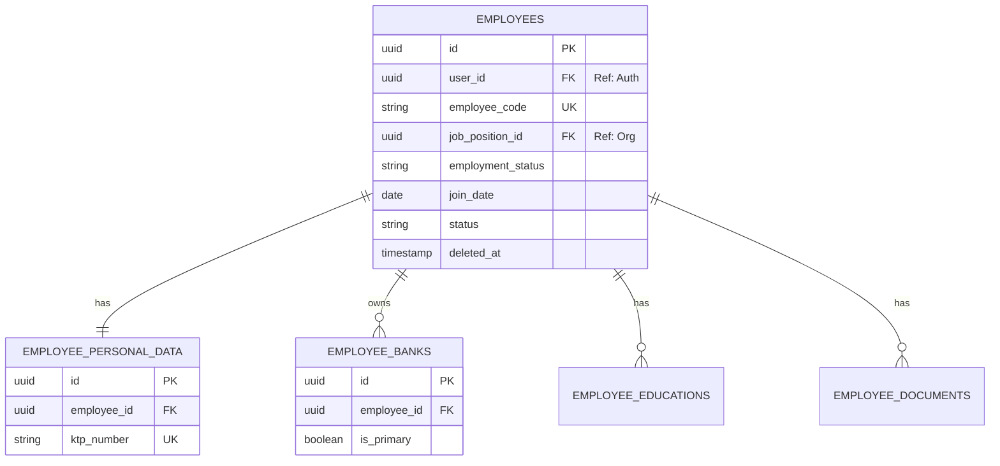

# Technical Specification: Employee Module

## 1. Overview & PRD Reference
This document serves as the architectural blueprint for the Employee module, translating business requirements into engineering specifications.
**PRD Reference:** [employee.md](../../requirement/employee.md)

## 2. System Architecture & Boundaries (DDD)
The Employee module is a Core Domain in the HRIS backend.
- **Aggregate Root:** `Employee`
- **Value Objects / Child Entities:** `PersonalData`, `Bank`, `Education`, `Document`
- **Folder Structure to be generated:**
  - `internal/domain/employee/` (Entities, Repository Interface)
  - `internal/application/employee/` (Use Cases / Services)
  - `internal/infrastructure/repository/` (Postgres implementation: `employee_postgres.go`)
  - `internal/interfaces/http/employee/` (Fiber Handlers & DTOs)

## 3. Database Schema
For the full relational mapping, refer to the DBML file at [docs/databases/employee.dbml](../../databases/employee.dbml).
The tables implement Soft Delete (`deleted_at`) and UUID v4 primary keys to ensure distributed uniqueness.

### 3.1. Main Tables
1. **`employees`**: Core employment data (relates to Job Position and Auth User).
2. **`employee_personal_data`**: 1-to-1 demographics (KTP, status).
3. **`employee_banks`**: 1-to-Many bank accounts for payroll.
4. **`employee_educations`** & **`employee_documents`**: 1-to-Many supporting records.

## 4. Mermaid ERD



## 5. API Contracts

### 5.1. Create Employee
**`POST /api/v1/employees`**
- **Request Payload:**
```json
{
  "employee_code": "HR-001",
  "job_position_id": "uuid-here",
  "join_date": "2024-01-01",
  "employment_status": "PERMANENT",
  "personal_data": {
    "full_name": "Budi Santoso",
    "ktp_number": "1234567890123456",
    "gender": "MALE",
    "marital_status": "MARRIED",
    "ptkp_status": "K/1"
  },
  "banks": [
    {
      "bank_name": "BCA",
      "account_number": "1234567890",
      "account_holder_name": "Budi Santoso",
      "is_primary": true
    }
  ]
}
```
- **Response (201 Created):** Standard API response containing the new Employee ID.

## 6. Implementation Details & Algorithms
- **Transactions (ACID):** Creating an employee involves inserting into multiple tables (`employees`, `employee_personal_data`, `employee_banks`). This **MUST** be wrapped in a single database transaction at the Application Service layer.
- **Domain Errors:**
  - `ErrEmployeeNotFound` (404)
  - `ErrKTPDuplicate` (422)
  - `ErrPrimaryBankRequired` (400)

## 7. Security, Performance & Technical Constraints
- **Security (Authz):** The create/update endpoints must be protected by a JWT middleware requiring the `HR_ADMIN` role.
- **Performance:** When fetching `GET /api/v1/employees`, the repository must use explicit SQL `JOIN`s to fetch `personal_data` to avoid N+1 query problems.
- **Data Masking:** If returning an employee profile to a regular user (not HR), the `ktp_number` and `account_number` must be masked in the Application Service layer before returning to the HTTP handler.
