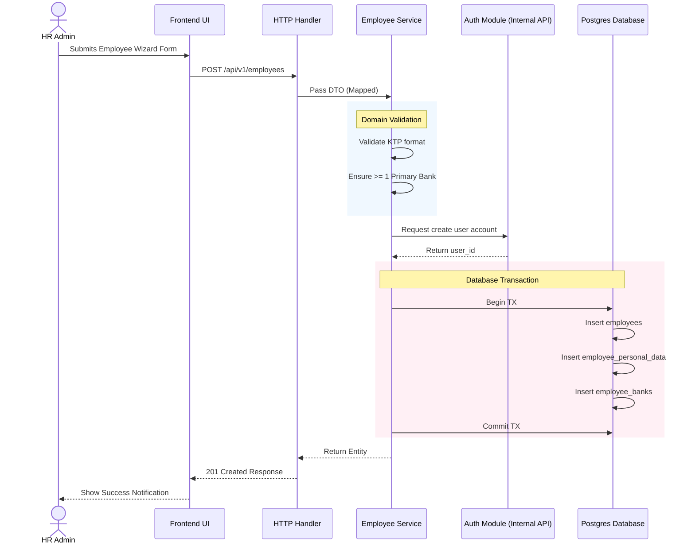

# User Stories & System Flows: Employee Module

## 1. User Stories

**US-01: Create New Employee**
- **As an** HR Admin
- **I want to** add a new employee to the system with their personal and bank details
- **So that** they are officially registered and can receive payroll.
- **Acceptance Criteria:**
  - System must validate that KTP is 16 digits.
  - System must ensure at least 1 primary bank account is provided.
  - System must rollback entirely if any sub-data (bank, personal) fails to save.

**US-02: Offboard Employee**
- **As an** HR Admin
- **I want to** offboard a resigning employee
- **So that** they no longer have access to the system but their historical data remains intact.
- **Acceptance Criteria:**
  - Status becomes `INACTIVE`.
  - `resign_date` is populated.
  - No records are physically deleted from the database (Soft Delete).
  - Triggers an event to the Auth Module to revoke login access.

---

## 2. Sequence Diagrams

### 2.1. Create Employee Flow (Happy Path)

This diagram illustrates the layered architecture communication when creating a new employee.

