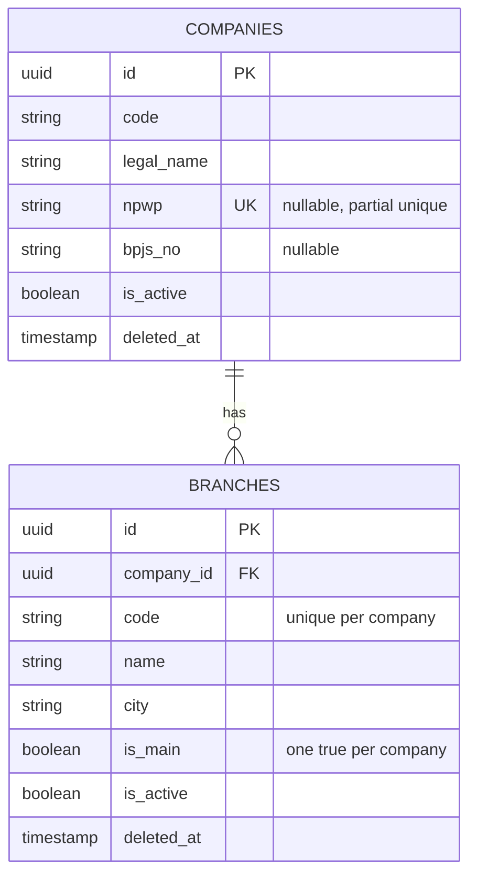
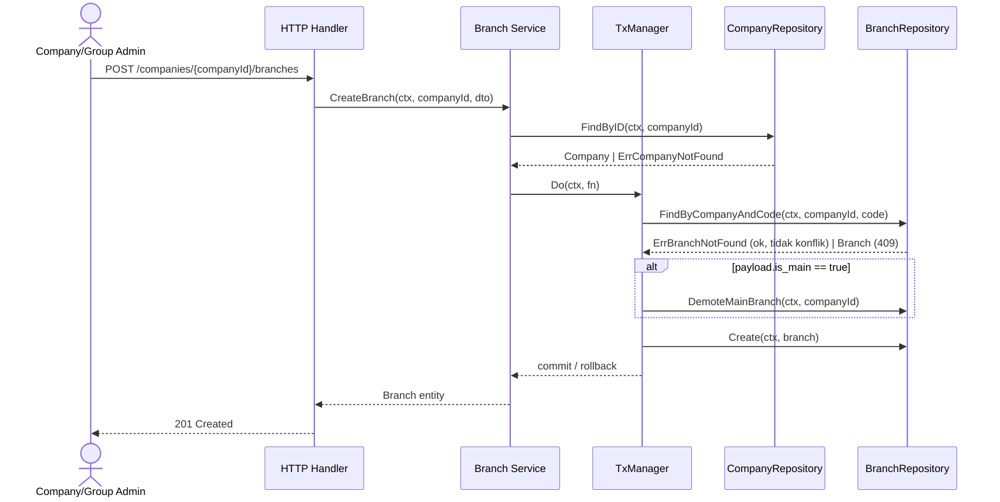

# Technical Specification: Organization Module (v2.1.0)

## 1. Overview & PRD Reference
Blueprint teknis modul `organization` scope 2.1.0 — **hanya Company (legal entity/PT) & Branch (lokasi/cabang)**. Department/Job Title/Job Position sudah pindah ke modul `workforce-structure` (di luar scope dokumen ini).

**Perubahan v2.1.0:** `GET /api/v1/companies` sekarang embed nested `branches` per company (composition read-only, bukan perubahan aggregate boundary — lihat ADR-006) dan tambah query param `search` (match `legal_name` ATAU nama branch). Detail kontrak §6.1, repository sketch §7.4.

**PRD Reference:** [organization.md](../../PRD/organization.md) (v2.0.0)
**DBML Reference:** [organization.dbml](../../databases/organization.dbml)
**Migration Reference:** [000002_create_organization_tables.up.sql](../../../migrations/000002_create_organization_tables.up.sql)

> Catatan gap: kode existing di `internal/domain/organization/`, `internal/application/organization/`, `internal/infrastructure/repository/organization_postgres.go`, `internal/interfaces/http/organization/` masih pola lama (layer-first) + scope lama (Department/JobTitle/JobPosition). Itu di luar scope dokumen ini — bukan implementasi Company/Branch, akan dipindah/rename ke `internal/workforce/` di fase terpisah (PRD §Fase 2). Dokumen & kode ini membuat context **baru**: `internal/organization/`.

## 2. System Architecture & Boundaries (DDD)
Bounded context `organization` berisi dua aggregate root independen (bukan parent-child dalam satu aggregate — Branch adalah aggregate root sendiri yang mereferensi Company by ID, bukan child entity yang dimuat bersama Company).

- **Aggregate Root 1:** `Company` — legal root, tanpa scope column (dia sendiri adalah scope).
- **Aggregate Root 2:** `Branch` — location root, scope `CompanyID` (Company-owned, [scoping-convention.md](../../../.agents/rules/scoping-convention.md) §1).
- **Value Objects / Child Entities:** tidak ada (kedua entity flat, tanpa child table di scope 2.0.0).

**Folder Structure (domain-first, sesuai [architecture.md](../../../.agents/rules/architecture.md)):**
```
internal/organization/
├── domain/
│   ├── company.go        # Company entity + New Company + sentinel errors
│   ├── branch.go          # Branch entity + NewBranch + sentinel errors
│   ├── repository.go      # CompanyRepository + BranchRepository interfaces
│   └── tx_manager.go       # TxManager abstraction (unit-of-work, persistence-convention.md §2)
├── application/
│   ├── service.go          # CompanyService + BranchService (koordinasi transaksi, mapping DTO)
│   └── dto.go
├── adapter/
│   ├── postgres.go         # CompanyRepository + BranchRepository impl + GormTxManager impl
│   └── models/
│       └── organization_model.go  # CompanyModel, BranchModel + mapper
└── transport/
    └── http/
        ├── handler.go       # CompanyHandler + BranchHandler
        └── router.go
```

## 3. Cross-Domain Dependencies
- **Upstream (depends on):** — tidak ada. Company/Branch adalah akar hierarki (PRD §6).
- **Downstream (consumed by):** Workforce Structure, Employee, RBAC (planned), Payroll (planned), Attendance/Leave (planned) — semua akan inject `organization/application.Service` (bukan repository langsung) untuk validasi `company_id`/`branch_id` sesuai [coding-convention.md](../../../.agents/rules/coding-convention.md) §4.
- **Communication Method:** Direct Application Service injection via `google/wire` (synchronous, in-process). Tidak ada event bus di scope ini.
- **Data Consistency:** Synchronous transaction per aggregate. Tidak ada saga — operasi lintas Company+Branch (mis. set main branch) tetap satu proses DB transaction di dalam bounded context yang sama.

## 4. Detailed Database Schema & Migrations
Skema lengkap: [organization.dbml](../../databases/organization.dbml). Ringkasan kolom & constraint:

### 4.1. `companies`
| Field | Type | Constraint |
|---|---|---|
| id | UUID | PK, default `gen_random_uuid()` |
| code | VARCHAR(20) | NOT NULL |
| legal_name | VARCHAR(150) | NOT NULL |
| npwp | VARCHAR(25) | NULL (belum dipakai — keputusan tim 2026-07-23), partial unique `idx_companies_npwp` WHERE `npwp IS NOT NULL AND deleted_at IS NULL` |
| bpjs_no | VARCHAR(50) | NULL (belum dipakai) |
| is_active | BOOLEAN | NOT NULL, default `true` |
| created_at / updated_at | TIMESTAMP | NOT NULL, default `now()` |
| deleted_at | TIMESTAMP | NULL (soft delete) |

### 4.2. `branches`
| Field | Type | Constraint |
|---|---|---|
| id | UUID | PK, default `gen_random_uuid()` |
| company_id | UUID | NOT NULL, FK → `companies.id`, index `idx_branches_company_id` |
| code | VARCHAR(20) | NOT NULL, partial unique `(company_id, code)` WHERE `deleted_at IS NULL` |
| name | VARCHAR(150) | NOT NULL |
| city | VARCHAR(100) | NULL |
| is_main | BOOLEAN | NOT NULL, default `false`, partial unique `(company_id)` WHERE `is_main = true AND deleted_at IS NULL` — tepat satu main branch per company |
| is_active | BOOLEAN | NOT NULL, default `true` |
| created_at / updated_at | TIMESTAMP | NOT NULL, default `now()` |
| deleted_at | TIMESTAMP | NULL (soft delete) |

## 5. Mermaid ERD



## 6. API Contracts

Semua response pakai envelope `pkg/response` (`code`, `status`, `message`, `data`). Base path `/api/v1`.

### 6.1. Companies

1. **`POST /api/v1/companies`** — Create Company
   - Payload: `code` (required, max 20), `legal_name` (required, max 150), `npwp` (optional, format `NN.NNN.NNN.N-NNN.NNN`), `bpjs_no` (optional).
   - Response `201`: Company object.
   - Errors: `422` (validation), `409` (`ErrCompanyNPWPDuplicate`, hanya jika `npwp` diisi), `500`.

2. **`GET /api/v1/companies`** — List Companies (pagination `page`, `limit`, sort `sort`/`order`, search `search`)
   - Query param `search` (opsional): match `legal_name ILIKE %search%` **ATAU** ada branch milik company itu yang `name ILIKE %search%` (`EXISTS` subquery, bukan `JOIN` — company tidak boleh terduplikasi di result kalau lebih dari satu branch match).
   - Response `200`: array Company, tiap item embed field `branches` (array Branch **lengkap milik company itu**, TIDAK di-filter oleh `search` — search cuma nentuin company mana yang lolos, bukan menyaring branch mana yang ditampilkan di dalamnya). `branches: []` (bukan `null`) kalau company belum punya branch.
   - `branches` diambil via query batch terpisah (`WHERE company_id IN (...)` atas seluruh company hasil halaman ini), BUKAN GORM `Preload`/association — lihat ADR-006 untuk alasan.

3. **`GET /api/v1/companies/{id}`** — Get Company by ID
   - Response `200` / `404` (`ErrCompanyNotFound`).

4. **`PUT /api/v1/companies/{id}`** — Update Company
   - Payload sama seperti create, field opsional pakai pointer (`*string`) untuk partial update.
   - Errors: `404`, `409` (NPWP conflict), `422`.

5. **`DELETE /api/v1/companies/{id}`** — Soft Delete Company
   - Errors: `404`.
   - **Catatan:** tidak menghapus Branch anak — akan direncanakan aturan cascade/`ErrCompanyHasBranches` di iterasi berikutnya bila dibutuhkan bisnis (belum ada di PRD acceptance criteria, tidak diimplementasikan sekarang).

### 6.2. Branches (nested di bawah Company untuk create/list, flat untuk aksi per-record)

1. **`POST /api/v1/companies/{companyId}/branches`** — Create Branch
   - Payload: `code` (required, max 20), `name` (required, max 150), `city` (optional), `is_main` (optional, default `false`).
   - Errors: `422`, `404` (`ErrCompanyNotFound` — company_id di path tak dikenal), `409` (`ErrBranchCodeDuplicate` dalam company yang sama).
   - Jika `is_main=true` dan sudah ada main branch lain di company yang sama → demote otomatis (lihat §8, ADR terkait di decision-log).

2. **`GET /api/v1/companies/{companyId}/branches`** — List Branches milik satu Company
   - Response `200`: array Branch (`[]` jika kosong). `404` jika `companyId` tak dikenal.

3. **`GET /api/v1/branches/{id}`** — Get Branch by ID
   - Response `200` / `404` (`ErrBranchNotFound`).

4. **`PUT /api/v1/branches/{id}`** — Update Branch
   - Payload sama seperti create (partial, pointer fields).
   - Errors: `404`, `409` (code conflict), `422`.
   - Set `is_main=true` di sini pun trigger demote otomatis main branch lama (sama seperti create).

5. **`DELETE /api/v1/branches/{id}`** — Soft Delete Branch
   - Errors: `404`.

## 7. Implementation Details & Algorithms

### 7.1. Layer Flow (Create Branch, contoh paling kompleks)


### 7.2. Database Transactions
Operasi yang WAJIB dibungkus `TxManager.Do` (persistence-convention.md §2, dimiliki Application Layer):
- **Create/Update Branch dengan `is_main=true`:** demote main branch lama + insert/update branch baru dalam satu transaksi (cegah race dua main branch aktif bersamaan).
- Operasi CRUD lain (Company create/update/delete, Branch tanpa `is_main` toggle) cukup single-statement, tidak perlu `TxManager` eksplisit.

### 7.3. Domain Errors
```go
ErrInvalidInput            // 422, validasi input generik
ErrCompanyNotFound          // 404
ErrCompanyNPWPDuplicate     // 409
ErrBranchNotFound            // 404
ErrBranchCodeDuplicate       // 409, unik dalam company yang sama
ErrBranchCompanyMismatch     // 422, dipakai fase mendatang saat entity lain validasi branch_id vs company_id (Employee dst.)
```

### 7.4. Repository Interface Sketch
```go
type CompanyRepository interface {
    Create(ctx context.Context, c *Company) error
    FindByID(ctx context.Context, id string) (*Company, error)   // ErrCompanyNotFound
    // search: kosong = tanpa filter. Non-kosong = WHERE legal_name ILIKE %search% OR EXISTS(branch match) — lihat §6.1.
    FindAll(ctx context.Context, page, limit int, sort, order, search string) ([]*Company, int64, error)
    Update(ctx context.Context, c *Company) error
    Delete(ctx context.Context, id string) error
}

type BranchRepository interface {
    Create(ctx context.Context, b *Branch) error
    FindByID(ctx context.Context, id string) (*Branch, error)                     // ErrBranchNotFound
    FindByCompanyAndCode(ctx context.Context, companyID, code string) (*Branch, error) // ErrBranchNotFound kalau kosong
    FindAllByCompany(ctx context.Context, companyID string, page, limit int, sort, order string) ([]*Branch, int64, error)
    // FindAllByCompanyIDs — batch, TANPA pagination (dipakai untuk embed nested branches
    // di GET /companies; jumlah branch per company diasumsikan kecil, lihat ADR-006).
    FindAllByCompanyIDs(ctx context.Context, companyIDs []string) ([]*Branch, error)
    DemoteMainBranch(ctx context.Context, companyID string) error // UPDATE branches SET is_main=false WHERE company_id=? AND is_main=true
    Update(ctx context.Context, b *Branch) error
    Delete(ctx context.Context, id string) error
}
```

## 8. Security, Performance & Technical Constraints
- **Security (Authz):** Semua endpoint WAJIB JWT middleware. Write (`POST`/`PUT`/`DELETE`) dibatasi role `OWNER` / `GROUP_ADMIN` (PRD §3) — enforcement penuh nyusul setelah modul RBAC landing (Fase 4); untuk sekarang cukup `AuthProtected` (autentikasi, belum otorisasi granular per role).
- **Performance:** `GET /companies/{id}/branches` WAJIB pagination (`page`, `limit`), default limit wajar (mis. 20) untuk cegah unbounded scan pada company dengan banyak cabang.
- **Search (`ILIKE '%...%'`):** sengaja TANPA index `pg_trgm` — volume `companies`/`branches` kecil (puluhan-ratusan row per grup usaha, bukan tabel operasional volume-tinggi seperti Attendance). Full scan diterima di scope ini; revisit index trigram kalau data tumbuh signifikan.
- **Nested branches di `GET /companies`:** batch query (`FindAllByCompanyIDs` dengan `WHERE company_id IN (...)`) atas seluruh company di halaman itu — 1 query tambahan per page, bukan N+1 per company. Lihat ADR-006.
- **Scoping (staged, [scoping-convention.md](../../../.agents/rules/scoping-convention.md) §4):** Repository `FindAll`/`FindAllByCompany` sudah WAJIB baca `scope.FromContext(ctx)` sesuai kontrak, tapi karena RBAC belum landing, scope selalu kosong (owner-mode, tanpa filter tambahan) untuk saat ini. Jangan tunda menulis signature-nya.
- **Data Masking:** Tidak ada field sensitif di scope 2.0.0 (npwp/bpjs_no bukan PII individu, aman ditampilkan ke role yang punya akses Company).
