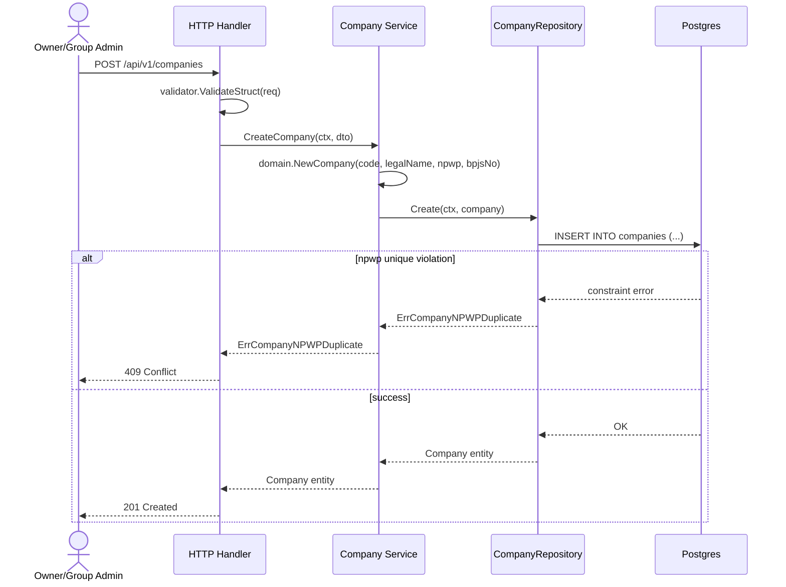
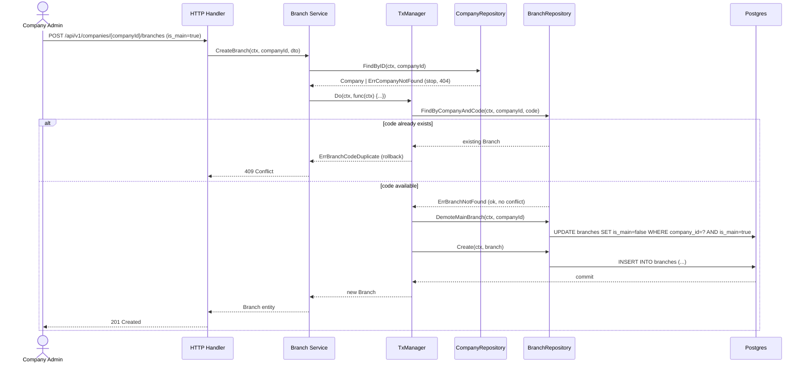

# User Stories & System Flows: Organization Module (v2.0.0)

## 1. User Stories

**US-01: Register New Company (PT)**
- **As an** Owner / Group Admin
- **I want to** register a new legal entity (PT) into the platform
- **So that** I can start managing its branches, employees, and payroll under one holding.
- **Acceptance Criteria:**
  - `code` and `legal_name` are required.
  - `npwp` is optional; if provided, must be unique across all companies (`ErrCompanyNPWPDuplicate` on conflict).
  - Two companies with `npwp = null` do not conflict with each other.
  - New company defaults `is_active = true`.

**US-02: Add Branch to a Company**
- **As a** Company Admin (HR PT-X)
- **I want to** add a new branch/office under my company
- **So that** attendance, employees, and local operations can be scoped to that location.
- **Acceptance Criteria:**
  - `company_id` in the URL path must reference an existing company (`ErrCompanyNotFound` if not).
  - `code` must be unique within that company only — same code is allowed in a different company (`ErrBranchCodeDuplicate` on conflict within same company).
  - No orphan branch is possible — a branch always resolves to exactly one company.

**US-03: Designate Main Branch (Head Office)**
- **As a** Company Admin
- **I want to** mark one branch as the main office (`is_main = true`)
- **So that** the system knows which branch represents legal HQ operations for that PT.
- **Acceptance Criteria:**
  - Exactly one branch per company can be `is_main = true` at any time.
  - Setting a new branch as main automatically demotes the previous main branch (see [decision-log.md](decision-log.md) ADR-004) — no manual two-step action needed.
  - This holds true even under concurrent requests (DB partial unique index is the final safety net).

**US-04: List & Browse Branches per Company**
- **As an** Owner / Group Admin or Company Admin
- **I want to** list all branches belonging to a specific company
- **So that** I get an overview of that PT's physical footprint.
- **Acceptance Criteria:**
  - Result is paginated.
  - Empty result returns `[]`, not `null`.
  - `404 ErrCompanyNotFound` if the company itself doesn't exist.

**US-05: Update / Soft-Delete Company or Branch**
- **As an** Owner / Group Admin
- **I want to** correct company/branch data or deactivate one that's no longer operating
- **So that** historical records (payroll, attendance) tied to it remain intact (soft delete, not hard delete).
- **Acceptance Criteria:**
  - Delete uses `deleted_at` (soft delete) — no hard `DELETE FROM`.
  - Deleting a company does **not** cascade-delete its branches in this scope (explicit gap, tracked in tech-spec.md §6.1).

---

## 2. Sequence Diagrams

### 2.1. Create Company Flow (Happy Path)

### 2.2. Create Branch with `is_main=true` (Auto-Demote Flow)

