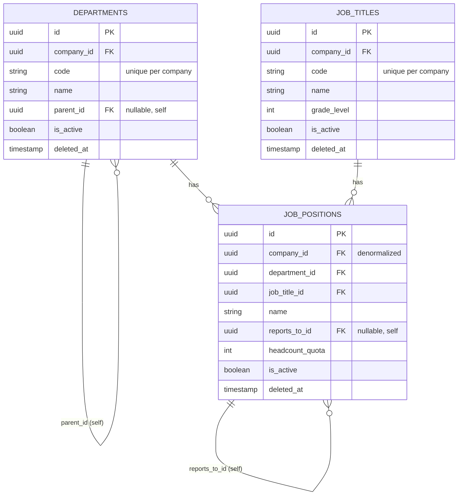
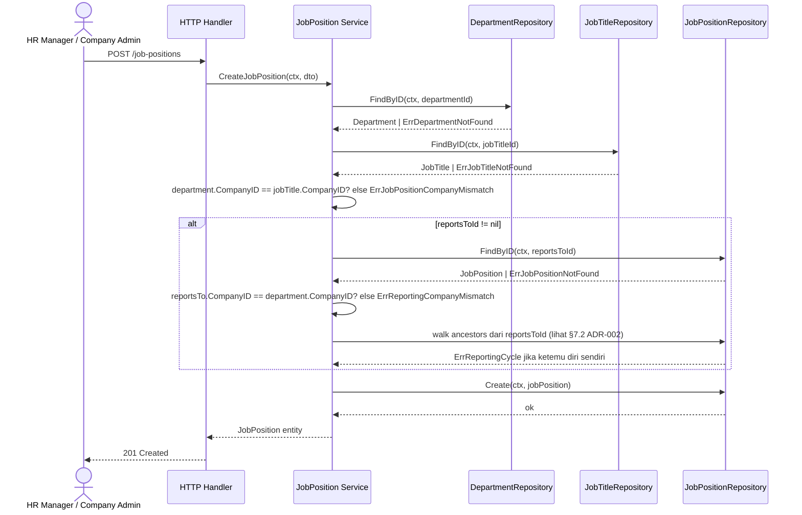

# Technical Specification: Workforce Structure Module (v1.2.0)

## 1. Overview & PRD Reference
Blueprint teknis modul `workforce-structure` — 3 pilar bagan organisasi internal *position-based*: **Department** (unit kerja, hierarki), **Job Title** (grade/pangkat, per-PT), **Job Position** (kursi = Department × Job Title, reporting line, headcount).

**Perubahan v1.1.0:** tiap endpoint List (`departments`, `job-titles`, `job-positions`) tambah query param `search` opsional.
**Perubahan v1.2.0:** tambah `GET /api/v1/departments/tree` (TANPA pagination, dipakai FE Tabel nested-row + Bagan — lihat ADR-007). `JobPositionResponse` sekarang embed `department`/`job_title` sebagai objek `{id, name}` (preload ringan, ganti `department_id`/`job_title_id` flat string) — lihat ADR-006.

**PRD Reference:** [workforce-structure.md](../../PRD/workforce-structure.md) (v1.1.0)
**DBML Reference:** [workforce-structure.dbml](../../databases/workforce-structure.dbml)
**Migration Reference:** [000003_create_workforce_structure_tables.up.sql](../../../migrations/000003_create_workforce_structure_tables.up.sql)

> **Status implementasi:** context baru `internal/workforce/` (domain-first) sudah live. Kode legacy pre-split (`internal/domain/organization/`, `internal/application/organization/`, `internal/interfaces/http/organization/`, plus `internal/infrastructure/repository/organization_postgres.go` & model terkait) sudah **dihapus** — tidak pernah punya migration/data produksi (dicek sebelum penghapusan, decision-log.md ADR-005), jadi tidak perlu backfill.

## 2. System Architecture & Boundaries (DDD)
Bounded context `workforce` berisi **tiga aggregate root independen** (bukan satu aggregate besar — konsisten dengan pola Company/Branch di ADR-003 organization: entity yang punya siklus hidup CRUD sendiri = aggregate root sendiri, direferensi by ID, bukan child collection).

- **Aggregate Root 1:** `Department` — scope `CompanyID` (Company-owned), self-referencing hierarki via `ParentID *string`.
- **Aggregate Root 2:** `JobTitle` — scope `CompanyID` (Company-owned), flat (tanpa child).
- **Aggregate Root 3:** `JobPosition` — scope `CompanyID` (denormalized, lihat ADR-001), referensi `DepartmentID` + `JobTitleID` + self-referencing `ReportsToID *string`.
- **Value Objects / Child Entities:** tidak ada child table terpisah di scope 1.0.0.

**Folder Structure (domain-first):**
```
internal/workforce/
├── domain/
│   ├── department.go        # Department entity + NewDepartment + sentinel errors
│   ├── job_title.go          # JobTitle entity + NewJobTitle + sentinel errors
│   ├── job_position.go        # JobPosition entity + NewJobPosition + sentinel errors
│   ├── hierarchy.go           # helper cycle-detection reusable (Department.ParentID & JobPosition.ReportsToID) — lihat ADR-002
│   ├── repository.go          # DepartmentRepository, JobTitleRepository, JobPositionRepository interfaces
│   └── tx_manager.go           # TxManager abstraction (persistence-convention.md §2)
├── application/
│   ├── service.go              # DepartmentService, JobTitleService, JobPositionService
│   └── dto.go
├── adapter/
│   ├── postgres.go             # 3 repository impl + GormTxManager impl
│   └── models/
│       └── workforce_model.go   # DepartmentModel, JobTitleModel, JobPositionModel + mapper
└── transport/
    └── http/
        ├── handler.go            # DepartmentHandler, JobTitleHandler, JobPositionHandler
        └── router.go
```

## 3. Cross-Domain Dependencies
- **Upstream (depends on):** `organization` — `Department.CompanyID` divalidasi via `organization/application.Service.FindCompanyByID` (Application Service injection, BUKAN inject `CompanyRepository` langsung — [coding-convention.md](../../../.agents/rules/coding-convention.md) §4).
- **Downstream (consumed by):** `employee` (planned) — akan inject `workforce/application.Service` untuk validasi `job_position_id` + baca headcount/reporting line saat assign karyawan.
- **Communication Method:** Direct Application Service injection via `google/wire` (synchronous, in-process).
- **Data Consistency:** Synchronous transaction per aggregate. Validasi cross-context (`company_id` Department harus exist di Organization) terjadi SEBELUM transaksi lokal dibuka — bukan distributed transaction/saga.

## 4. Detailed Database Schema & Migrations
Skema lengkap: [workforce-structure.dbml](../../databases/workforce-structure.dbml). Ringkasan kolom & constraint:

### 4.1. `departments`
| Field | Type | Constraint |
|---|---|---|
| id | UUID | PK, default `gen_random_uuid()` |
| company_id | UUID | NOT NULL, FK → `companies.id` (staged — lihat [scoping-convention.md](../../../.agents/rules/scoping-convention.md) §4), index `idx_departments_company_id` |
| code | VARCHAR(20) | NOT NULL, partial unique `(company_id, code)` WHERE `deleted_at IS NULL` |
| name | VARCHAR(150) | NOT NULL |
| parent_id | UUID | NULL, FK → `departments.id` (self), index `idx_departments_parent_id` |
| is_active | BOOLEAN | NOT NULL, default `true` |
| created_at / updated_at | TIMESTAMP | NOT NULL, default `now()` |
| deleted_at | TIMESTAMP | NULL (soft delete) |

### 4.2. `job_titles`
| Field | Type | Constraint |
|---|---|---|
| id | UUID | PK, default `gen_random_uuid()` |
| company_id | UUID | NOT NULL, FK → `companies.id`, index `idx_job_titles_company_id` |
| code | VARCHAR(20) | NOT NULL, partial unique `(company_id, code)` WHERE `deleted_at IS NULL` |
| name | VARCHAR(100) | NOT NULL |
| grade_level | INT | NOT NULL |
| is_active | BOOLEAN | NOT NULL, default `true` |
| created_at / updated_at | TIMESTAMP | NOT NULL, default `now()` |
| deleted_at | TIMESTAMP | NULL (soft delete) |

### 4.3. `job_positions`
| Field | Type | Constraint |
|---|---|---|
| id | UUID | PK, default `gen_random_uuid()` |
| company_id | UUID | NOT NULL, FK → `companies.id`, denormalized dari `department_id` (lihat ADR-001), index `idx_job_positions_company_id` |
| department_id | UUID | NOT NULL, FK → `departments.id`, index `idx_job_positions_department_id` |
| job_title_id | UUID | NOT NULL, FK → `job_titles.id`, index `idx_job_positions_job_title_id` |
| name | VARCHAR(150) | NOT NULL |
| reports_to_id | UUID | NULL, FK → `job_positions.id` (self), index `idx_job_positions_reports_to_id` |
| headcount_quota | INT | NOT NULL, default `1`, CHECK `headcount_quota >= 1` |
| is_active | BOOLEAN | NOT NULL, default `true` |
| created_at / updated_at | TIMESTAMP | NOT NULL, default `now()` |
| deleted_at | TIMESTAMP | NULL (soft delete) |

## 5. Mermaid ERD



## 6. API Contracts

Semua response pakai envelope `pkg/response` (`code`, `status`, `message`, `data`). Base path `/api/v1`.

### 6.1. Departments

1. **`POST /api/v1/departments`** — Create Department
   - Payload: `company_id` (required), `code` (required, max 20), `name` (required, max 150), `parent_id` (optional).
   - Errors: `422` (validasi), `404` (`ErrCompanyNotFound` — company_id tak dikenal, dicek via Organization Application Service), `409` (`ErrDepartmentCodeDuplicate` dalam company sama), `422` (`ErrDepartmentCompanyMismatch` — parent_id milik company lain), `422` (`ErrDepartmentCycle` — parent_id bikin loop).
   - Response `201`: Department object.

2. **`GET /api/v1/departments`** — List Departments (pagination `page`, `limit`, sort `sort`/`order`, search `search`)
   - `sort` whitelist: `code`, `name`, `created_at`, `updated_at`.
   - `search` (opsional): match `code` ATAU `name` (ILIKE substring, case-insensitive). Kosong = tanpa filter.
   - Response `200`: array Department (`[]` kalau kosong).

3. **`GET /api/v1/departments/tree`** — Full Department Tree (TANPA pagination, lihat ADR-007)
   - Response `200`: array **seluruh** Department aktif dalam scope company caller, tiap item termasuk `parent_id` untuk FE assembly tree/nested-row (root = `parent_id: null`).
   - Endpoint terpisah dari `GET /api/v1/departments` (paginated) — Tabel (nested row, expand/collapse) & Bagan (tree diagram) butuh dataset utuh, pagination server-side gak cocok karena parent & anak bisa kepisah halaman.

4. **`GET /api/v1/departments/{id}`** — Get Department by ID
   - Response `200` / `404` (`ErrDepartmentNotFound`).

5. **`PUT /api/v1/departments/{id}`** — Update Department
   - Payload sama seperti create, field opsional pakai pointer untuk partial update.
   - Errors: `404`, `409` (code conflict), `422` (company mismatch / cycle).

6. **`DELETE /api/v1/departments/{id}`** — Soft Delete Department
   - Errors: `404`.
   - **Catatan:** tidak mem-validasi child Department/Job Position — sama seperti gap eksplisit Company/Branch (organization tech-spec §6.1 poin 5), belum ada di PRD acceptance criteria, tidak diimplementasikan sekarang.

### 6.2. Job Titles

1. **`POST /api/v1/job-titles`** — Create Job Title
   - Payload: `company_id` (required), `code` (required, max 20), `name` (required, max 100), `grade_level` (required, int).
   - Errors: `422`, `404` (`ErrCompanyNotFound`), `409` (`ErrJobTitleCodeDuplicate` dalam company sama).
   - Response `201`: Job Title object.

2. **`GET /api/v1/job-titles`** — List Job Titles (pagination, sort `code`/`name`/`grade_level`/`created_at`/`updated_at`, search `search`)
   - `search` (opsional): match `code` ATAU `name` (ILIKE substring, case-insensitive). Kosong = tanpa filter.
   - Response `200`: array Job Title (`[]` kalau kosong).

3. **`GET /api/v1/job-titles/{id}`** — Get Job Title by ID
   - Response `200` / `404` (`ErrJobTitleNotFound`).

4. **`PUT /api/v1/job-titles/{id}`** — Update Job Title
   - Errors: `404`, `409` (code conflict), `422`.

5. **`DELETE /api/v1/job-titles/{id}`** — Soft Delete Job Title
   - Errors: `404`.

### 6.3. Job Positions

> **Response shape (v1.2.0):** `department` & `job_title` di response BUKAN `department_id`/`job_title_id` string — melainkan objek preload `{id, name}` (`JobPositionRef`), diisi via batch lookup di Application Layer supaya FE gak perlu request terpisah buat nampilin nama (lihat ADR-006). Payload **request** (create/update) tetap pakai `department_id`/`job_title_id` string flat seperti biasa — cuma response yang berubah.

1. **`POST /api/v1/job-positions`** — Create Job Position
   - Payload: `department_id` (required), `job_title_id` (required), `name` (required, max 150), `reports_to_id` (optional), `headcount_quota` (optional, default `1` — lihat ADR-003).
   - Errors: `422` (validasi), `404` (`ErrDepartmentNotFound` / `ErrJobTitleNotFound`), `422` (`ErrJobPositionCompanyMismatch` — Department & Job Title beda company), `422` (`ErrReportingCompanyMismatch` — reports_to_id beda company), `422` (`ErrReportingCycle` — reports_to_id bikin loop).
   - `company_id` **tidak** di-input client — diturunkan otomatis dari `department_id` (denormalisasi, ADR-001).
   - Response `201`: Job Position object (`department`/`job_title` sebagai `{id, name}`, lihat catatan di atas).

2. **`GET /api/v1/job-positions`** — List Job Positions (pagination, sort `name`/`headcount_quota`/`created_at`/`updated_at`, search `search`)
   - `search` (opsional): match `name` (ILIKE substring, case-insensitive) — Job Position gak punya kolom `code`. Kosong = tanpa filter.
   - Response `200`: array Job Position (`[]` kalau kosong).

3. **`GET /api/v1/job-positions/chart`** — Full Org Chart (TANPA pagination, lihat ADR-004)
   - Response `200`: array **seluruh** Job Position aktif dalam scope company caller, tiap item termasuk `reports_to_id` untuk FE bangun tree client-side (PRD §Catatan FE poin 2, root = `reports_to_id: null`).
   - Endpoint terpisah dari `GET /api/v1/job-positions` (paginated) — org chart butuh dataset utuh, bukan satu halaman.

4. **`GET /api/v1/job-positions/{id}`** — Get Job Position by ID
   - Response `200` / `404` (`ErrJobPositionNotFound`).

5. **`PUT /api/v1/job-positions/{id}`** — Update Job Position
   - Errors: `404`, `422` (company mismatch / reporting cycle).

6. **`DELETE /api/v1/job-positions/{id}`** — Soft Delete Job Position
   - Errors: `404`.
   - **Catatan:** tidak mem-validasi apakah masih ada Job Position lain yang `reports_to_id` menunjuk ke sini — di luar scope PRD (§2 Out-of-Scope: occupancy/assignment ada di modul Employee; integritas reporting line pasca-delete didokumentasikan sebagai gap, bukan diimplementasikan sekarang).

## 7. Implementation Details & Algorithms

### 7.1. Layer Flow (Create Job Position, contoh paling kompleks)


### 7.2. Cycle Detection Algorithm (Department.ParentID & JobPosition.ReportsToID)
Kedua entity self-referencing (`Department.ParentID`, `JobPosition.ReportsToID`) pakai algoritma sama — lihat **ADR-002** untuk alasan pemilihan.

```go
// domain/hierarchy.go — dipakai Department & JobPosition
// walks up parent chain via repo.FindParentID(ctx, id), max depth guard cegah infinite loop kalau ada bug data.
func DetectCycle(ctx context.Context, candidateID, newParentID string, findParentID func(ctx context.Context, id string) (*string, error)) error {
    const maxDepth = 100
    current := &newParentID
    for depth := 0; depth < maxDepth; depth++ {
        if current == nil {
            return nil // sampai root, tidak ada cycle
        }
        if *current == candidateID {
            return ErrHierarchyCycle
        }
        parent, err := findParentID(ctx, *current)
        if err != nil {
            return err
        }
        current = parent
    }
    return ErrHierarchyCycle // depth exceeded — anggap cycle/data korup
}
```
Dipanggil di Application Service SEBELUM `Create`/`Update` dengan `parent_id`/`reports_to_id` baru. `candidateID` = ID entity yang sedang dibuat/diubah (kosong untuk Create baru — cycle mustahil pada baris yang belum exist, jadi guard ini efektif hanya relevan di Update; Create baru cukup pastikan `newParentID` valid & exist).

### 7.3. Database Transactions
Operasi yang WAJIB dibungkus `TxManager.Do` (persistence-convention.md §2):
- **Create Job Position:** validasi Department+JobTitle+ReportsTo company match, cycle check, lalu insert — dibungkus satu transaksi supaya validasi & insert atomik terhadap race (dua request paralel bikin cycle bersamaan).
- **Update Department/JobPosition dengan perubahan `parent_id`/`reports_to_id`:** cycle check + update dalam satu transaksi.
- CRUD lain (create Department/JobTitle tanpa parent, update field non-hierarki) cukup single-statement.

### 7.4. Domain Errors
```go
ErrInvalidInput                 // 422, validasi input generik
ErrDepartmentNotFound            // 404
ErrDepartmentCodeDuplicate       // 409, unik dalam company yang sama
ErrDepartmentCompanyMismatch     // 422, parent_id milik company lain
ErrJobTitleNotFound               // 404
ErrJobTitleCodeDuplicate          // 409, unik dalam company yang sama
ErrJobPositionNotFound             // 404
ErrJobPositionCompanyMismatch      // 422, department & job_title beda company
ErrReportingCompanyMismatch         // 422, reports_to_id beda company (PRD §4 "Reporting line tak lintas Company")
ErrHierarchyCycle                    // 422, dipakai Department.ParentID DAN JobPosition.ReportsToID (PRD §4 "Reporting line anti-siklus")
```
Catatan: PRD §5 sebut nama `ErrReportingCycle` — tech-spec ini generalisasi jadi `ErrHierarchyCycle` karena algoritma & sentinel error dipakai bersama oleh Department (parent_id) juga, bukan cuma Job Position. Pesan error tetap kontekstual di message HTTP, cuma nama Go sentinel yang digeneralisasi.

### 7.5. Repository Interface Sketch
```go
type DepartmentRepository interface {
    Create(ctx context.Context, d *Department) error
    FindByID(ctx context.Context, id string) (*Department, error) // ErrDepartmentNotFound
    FindByCompanyAndCode(ctx context.Context, companyID, code string) (*Department, error) // cek duplikasi code, ErrDepartmentNotFound kalau kosong
    FindParentID(ctx context.Context, id string) (*string, error) // dipakai DetectCycle, ErrDepartmentNotFound jika id tak ada
    // search: kosong = tanpa filter. Non-kosong = WHERE code ILIKE %search% OR name ILIKE %search%.
    FindAll(ctx context.Context, page, limit int, sort, order, search string) ([]*Department, int64, error)
    // FindAllTree — TANPA pagination, dipakai GET /departments/tree (ADR-007).
    FindAllTree(ctx context.Context) ([]*Department, error)
    // FindNamesByIDs — batch id->name, dipakai embed `department` di JobPositionResponse (ADR-006).
    FindNamesByIDs(ctx context.Context, ids []string) (map[string]string, error)
    Update(ctx context.Context, d *Department) error
    Delete(ctx context.Context, id string) error
}

type JobTitleRepository interface {
    Create(ctx context.Context, jt *JobTitle) error
    FindByID(ctx context.Context, id string) (*JobTitle, error) // ErrJobTitleNotFound
    FindByCompanyAndCode(ctx context.Context, companyID, code string) (*JobTitle, error) // cek duplikasi code, ErrJobTitleNotFound kalau kosong
    // search: kosong = tanpa filter. Non-kosong = WHERE code ILIKE %search% OR name ILIKE %search%.
    FindAll(ctx context.Context, page, limit int, sort, order, search string) ([]*JobTitle, int64, error)
    // FindNamesByIDs — batch id->name, dipakai embed `job_title` di JobPositionResponse (ADR-006).
    FindNamesByIDs(ctx context.Context, ids []string) (map[string]string, error)
    Update(ctx context.Context, jt *JobTitle) error
    Delete(ctx context.Context, id string) error
}

type JobPositionRepository interface {
    Create(ctx context.Context, jp *JobPosition) error
    FindByID(ctx context.Context, id string) (*JobPosition, error)     // ErrJobPositionNotFound
    FindParentID(ctx context.Context, id string) (*string, error)       // reports_to_id, dipakai DetectCycle
    // search: kosong = tanpa filter. Non-kosong = WHERE name ILIKE %search% (gak ada kolom code).
    FindAll(ctx context.Context, page, limit int, sort, order, search string) ([]*JobPosition, int64, error)
    // FindAllChart TANPA parameter companyIDs eksplisit — scope-aware via scope.FromContext(ctx)
    // begitu RBAC landing (staged, sama seperti FindAll lain di modul ini), bukan parameter caller. ADR-004.
    FindAllChart(ctx context.Context) ([]*JobPosition, error)
    Update(ctx context.Context, jp *JobPosition) error
    Delete(ctx context.Context, id string) error
}
```

## 8. Security, Performance & Technical Constraints
- **Security (Authz):** Semua endpoint WAJIB JWT middleware. Write dibatasi role `OWNER`/`COMPANY_ADMIN`/`HR_MANAGER` (PRD §3) — enforcement penuh nyusul RBAC (Fase 4); untuk sekarang cukup `AuthProtected`.
- **Performance:** `GET /departments`, `/job-titles`, `/job-positions` WAJIB pagination via `pkg/pagination` ([pagination-convention.md](../../../.agents/rules/pagination-convention.md)). `GET /job-positions/chart` DAN `GET /departments/tree` sengaja EXEMPT dari pagination — lihat ADR-004 & ADR-007 (dataset per-company diasumsikan kecil, ratusan row, tree/chart butuh keutuhan data bukan satu halaman).
- **Cycle detection cost:** `DetectCycle` worst-case O(depth) query individual per hop (bukan recursive CTE) — diterima karena depth org chart realistis rendah (< 20 level). Lihat ADR-002 untuk trade-off vs recursive CTE.
- **`FindNamesByIDs` batch cost:** dua query tambahan (department + job title) per request List/Chart Job Position — bukan N+1 per row (ADR-006). `IN (...)` list boleh ada duplikat id (mis. banyak posisi satu department) — diterima, volume kecil.
- **Scoping (staged, [scoping-convention.md](../../../.agents/rules/scoping-convention.md) §4):** Repository `FindAll`/`FindAllChart`/`FindAllTree` WAJIB baca `scope.FromContext(ctx)` sesuai kontrak signature, tapi karena RBAC belum landing, scope selalu kosong (owner-mode) untuk saat ini.
- **Data Masking:** Tidak ada field sensitif di scope 1.0.0.
