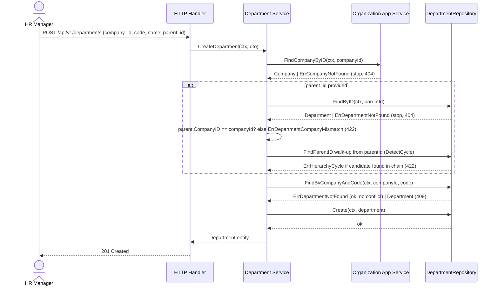
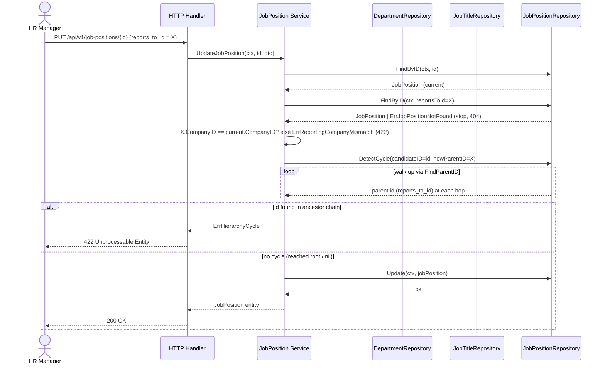

# User Stories & System Flows: Workforce Structure Module (v1.0.0)

## 1. User Stories

**US-01: Build Department Hierarchy**
- **As an** HR Manager / Company Admin
- **I want to** create departments and nest them under a parent department
- **So that** the org chart reflects real divisional structure (e.g. Direksi → Divisi TI → Departemen Pengembangan).
- **Acceptance Criteria:**
  - `company_id` is required; must reference an existing company (`ErrCompanyNotFound` if not).
  - `parent_id` is optional — `null` means root department.
  - `parent_id`, if provided, must belong to the same `company_id` (`ErrDepartmentCompanyMismatch` on cross-company parent).
  - `code` must be unique within that company only (`ErrDepartmentCodeDuplicate` on conflict within the same company).
  - Re-parenting a department to one of its own descendants is rejected (`ErrHierarchyCycle`).

**US-02: Define Job Title Grades per Company**
- **As an** HR Manager
- **I want to** maintain a master list of job titles/grades (e.g. Direktur, Manajer, Staf) scoped to my company
- **So that** salary bands and career levels stay standardized within my PT, independent of which department someone sits in.
- **Acceptance Criteria:**
  - `company_id` required; grades are never shared across companies (scoping-convention.md — Company-owned class).
  - `code` unique within the company; `grade_level` is a plain integer, higher = more senior.
  - Two companies may reuse the same `code` (e.g. both have `MGR`) without conflict.

**US-03: Open a Job Position (Seat)**
- **As an** HR Manager
- **I want to** combine a Department and a Job Title into an actual position with a reporting line and headcount quota
- **So that** I have a concrete "seat" employees can later be assigned to, independent of who fills it.
- **Acceptance Criteria:**
  - `department_id` and `job_title_id` are required and must resolve to existing records (`ErrDepartmentNotFound` / `ErrJobTitleNotFound`).
  - Department and Job Title must belong to the same company (`ErrJobPositionCompanyMismatch` otherwise) — `company_id` on the position is derived automatically, not client-supplied.
  - `reports_to_id` is optional; if provided, must reference a position in the **same company** (`ErrReportingCompanyMismatch`) and must not create a cycle (`ErrHierarchyCycle`).
  - `headcount_quota` defaults to `1` when omitted or `< 1` — never rejected for a missing value (see [decision-log.md](decision-log.md) ADR-003).

**US-04: Prevent Circular Reporting Lines**
- **As the** system (data-integrity guarantee, not a user-facing action)
- **I want to** reject any `reports_to_id`/`parent_id` change that would make an entity its own (in)direct ancestor
- **So that** the org chart never enters an infinite loop that breaks tree rendering or approval-chain logic in future modules (Leave/Attendance).
- **Acceptance Criteria:**
  - Applies identically to `Department.parent_id` and `JobPosition.reports_to_id` (shared algorithm, see [decision-log.md](decision-log.md) ADR-002).
  - A→B→A (2-hop) and deeper chains are both caught.
  - Self-reference (`id == parent_id`/`id == reports_to_id` on the same request) is caught as a trivial 1-hop cycle.

**US-05: Render the Organization Chart**
- **As an** Owner / HR Manager / Employee (read-only)
- **I want to** fetch the complete set of active job positions for my company in one call
- **So that** the frontend can render a full tree (via `reports_to_id`) without missing branches due to pagination cutoffs.
- **Acceptance Criteria:**
  - `GET /api/v1/job-positions/chart` returns **all** active positions in scope, not a paginated page (see [decision-log.md](decision-log.md) ADR-004).
  - Root positions have `reports_to_id: null`.
  - Regular `GET /api/v1/job-positions` (management/browse view) remains paginated as usual — the two endpoints serve different purposes.

**US-06: Update or Deactivate Structure Entities**
- **As an** HR Manager
- **I want to** correct department/job title/job position data or soft-delete ones no longer in use
- **So that** historical references (future Employee assignments, audit trail) stay intact.
- **Acceptance Criteria:**
  - Delete uses `deleted_at` (soft delete) — no hard `DELETE FROM`.
  - Deleting a Department does **not** cascade-delete its child Departments or Job Positions in this scope (explicit gap, tracked in tech-spec.md §6.1/§6.3).
  - Deleting a Job Position does **not** validate whether other positions still `reports_to_id` it (explicit gap, tech-spec.md §6.3 poin 6).

---

## 2. Sequence Diagrams

### 2.1. Create Department with Parent (Hierarchy + Cross-Company Guard)

### 2.2. Create Job Position — Reject on Reporting Cycle

